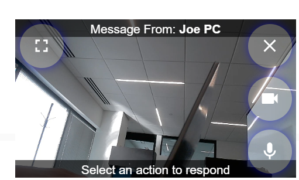

# HA Intercom

An intercom and announcement system for use with Home Assistant.


- One intercom configuration for multiple targets and clients


- Incoming audio/video calls now displayed by recieving clients (if capable)


- The original mode is still supported

## Features

- Low latency, one-way audio intercom/announcements for supported media_player types
- One-way audio to "active" HA-Intercom clients (cilents connected to HA intercom can recieve audio, like wallpanels with HA-Intercom components on the dashboard)
- Announcements via TTS media_player types that do not support local audio (ie: Alexa Media Player)

## Notes

Release 2.0 is moving away from using multiple HA-Intercom cards in favor of a single card with multiple target options. Also moving away from holding the microphone button down in favor of a click once to start, click close to stop. There are configuration options to revert to using these 'older' methods, if you prefer.

These changes were introduced to provide a better client-to-client experience, including video calling/broadcasting.

Upcoming changes:

Move from pure Websockets to WebRTC.

## Container Installation

### Docker Images
https://hub.docker.com/repository/docker/josephhogan/ha-intercom/general

```
image: josephhogan/ha-intercom:latest
```

Please see below for required environment variables for the Docker container.

## Home Assistant Installation (via HACS)

1. Go to HACS → Integrations → ⋮ → Custom repositories.
2. Add:

https://github.com/JoeHogan/ha-intercom

with category **Integration**.
3. Install **HA Intercom**.
4. Restart Home Assistant.
5. Add the integration via *Settings → Devices & Services → Add Integration → HA Intercom*.
6. Input the URL and port of your HA Intercom docker instance

## Home Assistant YAML config example

```yaml
  - type: custom:ha-intercom-card
    clientId: client_1
    video: true
    display: collapse
    position: inline
    targets:
      - name: Main Floor TV
        entities:
          - entity_id: media_player.my_fire_tv
            type: alexa
            data:
              type: announce
      - name: Kitchen
        entities:
          - entity_id: >-
              media_player.esphome_voice_satellite
            type: audio
      - name: Kitchen and TV
        entities:
          - entity_id: >-
              media_player.esphome_voice_satellite
            type: audio
          - entity_id: media_player.my_fire_tv
            type: alexa
            data:
              type: announce
```

### Config options

- clientId
    - string
    - create a unique ID for your intecom; this is used to identify the client instance on the backend
- video
    - boolean
    - default: false
    - whether your client supports video (assumes you have a camera)
- display
    - default, collapse, single
    - default: default
    - how you want the card to behave when showing clients; using the 'single' option reverts to using the version 1.x mode of a single intercom that you hold to speak
- position
    - inline, fixed
    - default: fixed
    - determines where on the screen you want outgoing/incoming messages to be displayed. Fixed positions the container on the bottom right of your screen when a message is being sent/recieved

### Client Configuration

- After configuring your YAML, you will be presented with the client configuration to give your ha-intercom client instance a name and entity_id. The purpose of this is to identify different clients using the same configuration on the same dashboard. For example, you may share one dashboard for all of your wallpanels; in order to call wallpanel one from wallpanel two, they need unique ids which cannot be done in the yaml config (since it is the same dashboard). This configuration provides you that ability.


## Requirements

- Docker
- HTTPS connection to Home Assistant (for micorphone use)
- Faster-Whisper for STT

## Installation

- Clone repo
- Add .env file to root
- run `docker compose build`
- run `docker compose up`

# Docker Compose Example

```yaml
services:
  ha_intercom:
    image: josephhogan/ha-intercom:latest
    container_name: ha-intercom
    environment:
      AUDIO_HOST: "http://192.168.X.X:3001" # optional
      HOME_ASSISTANT_URL: "http://192.168.X.X:8123" #optional
      WHISPER_HOST: "192.168.X.X:10300" # required for TTS
      TTS_PREFIX: "Incoming Notification:" # optional
      HOME_ASSISTANT_ACCESS_TOKEN: "[your long-lived access token]" # optional
    restart: always
    ports:
      - 3001:3001
```

# Environment Variables

- AUDIO_HOST=http://192.168.1.X:3001
    - Optional
    - Derived from the Home Assistant HA-Intercom config.
    - Set this to override the Integration default.
- WHISPER_HOST=192.168.1.X:10300
    - Required for STT
    - The IP Address and PORT of your Whisper instance.
- HOME_ASSISTANT_URL=https://my-ha-instance-url:8123
    - Optional
    - Will use your configured Home Assistant External URL, Internal URL, or the derived request origination url, in that order by default.
    - Set this to override the Integration default.
- HOME_ASSISTANT_ACCESS_TOKEN= ... 
    - Optional
    - Will use a token passed via the integration by default.
    - Set this to override the Integration default.
- TTS_PREFIX=Incoming Notification:
    - Optional
    - Used to prefix TTS notifications.
    - Can also be set in the HA-Intercom YAML config per device. Doing so will override this global value.
- AUDIO_POOL_SIZE=2
    - Optional pool size for warm FFMPEG audio instances
    - Default: 2
- STT_POOL_SIZE=2
    - Optional pool size for warm FFMPEG stt instances
    - Default: 1
- OUTPUT_TYPE=mp3
    - Optional
    - Options: mp3, wav
    - Default: mp3
