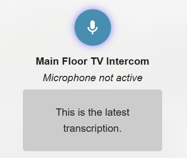

# HA Intercom

An intercom and announcement system for use with Home Assistant.



## Features

- Low latency audio intercom for supported media_player types
- Announcements via TTS to supported media_player types (ie: Alexa)

## Home Assistant YAML config example

```yaml
- type: custom:intercom-widget
    name: Audio Intercom
    hideStatus: false
    hideTranscription: false
    target:
        - entity_id: media_player.esp32_media_player
          type: audio

- type: custom:intercom-widget
    name: TTS Intercom
    target:
        - entity_id: media_player.esp32_media_player2
          type: tts
          voice: my-piper-voice-medium

- type: custom:intercom-widget
    name: Alexa Intercom
    target:
        - entity_id: media_player.my_alexa
          type: alexa

- type: custom:intercom-widget
    name: Fire TV Intercom
    target:
        - entity_id: media_player.fire_tv
          type: alexa
            data:
                type: announce

- type: custom:intercom-widget
    name: Everywhere Intercom
    target:
        - entity_id: media_player.esp32_media_player
          type: audio
        - entity_id: media_player.esp32_media_player2
          type: tts
          voice: my-piper-voice-medium
        - entity_id: media_player.my_alexa
          type: alexa
        - entity_id: media_player.fire_tv
          type: alexa
            data:
                type: announce
```

## Requirements

- Docker
- HTTPS connection to Home Assistant (for micorphone use)
- Faster-Whisper for STT
- an HTTP proxy, like nginx

## Installation

- Clone repo
- Add .env file to root
- run `docker compose build`
- run `docker compose up`

# Environment Settings (.env file)

- HOST=192.168.1.X
- PORT=3001
- AUDIO_HOST=http://192.168.1.X:3001
- WHISPER_HOST=192.168.1.X
- WHISPER_PORT=10300
- HOME_ASSISTANT_URL=https://my-ha-instance-url:8123
- HOME_ASSISTANT_ACCESS_TOKEN= ...

# Nginx config example

- The widget in Home Assistant makes web-socket requests to /api/intercom
- You must proxy these requests to the host and port of your ha-intercom docker container
- This is an Nginx example which modifies an existing Home Assistant SSL proxy:

```

upstream home_assistant {
    server                 192.168.1.X:8123;
}

upstream intercom_proxy {
    server                 192.168.1.X:3001;
}


server {
    listen        8123 ssl;
    ssl_certificate         /etc/ssl/private/my-domain.fullchain.pem;
    ssl_certificate_key     /etc/ssl/private/my-domain.key.pem;
    ssl_trusted_certificate /etc/ssl/private/my-domain.chain.pem;

    location /api/intercom {
            proxy_http_version 1.1;
            proxy_set_header Upgrade $http_upgrade;
            proxy_set_header Connection $connection_upgrade;
            proxy_pass http://intercom_proxy/api/intercom;
    }

    location / {
        proxy_http_version 1.1;
        proxy_set_header Upgrade $http_upgrade;
        proxy_set_header Connection $connection_upgrade;
        proxy_pass http://home_assistant;
    }

}     

```

# Usage

 ## Home Assistant
 - To add the micorphone widget to your Home Assistant for use in dashboards, you must copy the intercom-widget.js file from this repo in /public/intercom-widget.js to your Home Assistant /www directory.
 - Once copied to the www directory in Home Assistant, add a JavaScript module resource in Dashboards > Resources (/config/lovelace/resources) which points to this file. You can now use this widget via the YAML examples above.