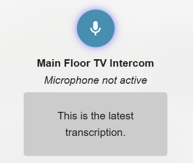

# HA Intercom

An intercom and announcement system for use with Home Assistant.



## Features

- Low latency, one-way audio intercom/announcements for supported media_player types
- One-way audio to "active" HA-Intercom clients (cilents connected to HA intercom can recieve audio, like wallpanels with HA-Intercom components on the dashboard)
- Announcements via TTS media_player types that do not support local audio (ie: Alexa Media Player)

## Notes

This is a work in progress. I'm porting this over from a standalone container solution to a Home Assistant Integration.

## Container Installation

### Docker Images
https://hub.docker.com/repository/docker/josephhogan/ha-intercom/general

```
image: josephhogan/ha-intercom:latest
```

Please see below for required environment variables for the Docker container.

## Home Assistant Installation (via HACS)

1. Go to HACS → Integrations → ⋮ → Custom repositories.
2. Add:

https://github.com/JoeHogan/ha-intercom

with category **Integration**.
3. Install **HA Intercom**.
4. Restart Home Assistant.
5. Add the integration via *Settings → Devices & Services → Add Integration → HA Intercom*.
6. Input the URL and port of your HA Intercom docker instance

## Home Assistant YAML config example

```yaml
- type: custom:ha-intercom-card
  name: Audio Intercom
  ttsPrefix: "Incoming Notification:"
  hideStatus: false
  hideTranscription: false
  target:
    - entity_id: media_player.esp32_media_player
      type: audio

- type: custom:ha-intercom-card
  name: TTS Intercom
  target:
    - entity_id: media_player.esp32_media_player2
      type: tts
      voice: my-piper-voice-medium

- type: custom:ha-intercom-card
  name: Alexa Intercom
  target:
    - entity_id: media_player.my_alexa
      type: alexa

- type: custom:ha-intercom-card
  name: Fire TV Intercom
  target:
    - entity_id: media_player.fire_tv
      type: alexa
        data:
          type: announce

- type: custom:ha-intercom-card
  name: Everywhere Intercom
  target:
    - entity_id: media_player.esp32_media_player
      type: audio
    - entity_id: media_player.esp32_media_player2
      type: tts
      voice: my-piper-voice-medium
    - entity_id: media_player.my_alexa
      type: alexa
    - entity_id: media_player.fire_tv
      type: alexa
        data:
            type: announce
```

### HA-Intercom to HA-Intercom communication
- This merits a separate example because intercom to intercom communication requires:
    - providing a unique "id" property for each Intercom client you wish to broadcast to
    - using a special "ha_client" prefix on the target entity_id
        - ie: entity_id: ha_client.[target client id]

#### Example, Intercom Client 1 can send to Intercom Client 2, and Intercom Client 2 can send to Intercom Client 1
```yaml

- type: custom:ha-intercom-card
  name: Client 1
  id: client_1
  target:
    - entity_id: ha_client.client_2

- type: custom:ha-intercom-card
  name: Client 2
  id: client_2
  target:
    - entity_id: ha_client.client_1

```

## Requirements

- Docker
- HTTPS connection to Home Assistant (for micorphone use)
- Faster-Whisper for STT

## Installation

- Clone repo
- Add .env file to root
- run `docker compose build`
- run `docker compose up`

# Docker Compose Example

```yaml
services:
  ha_intercom:
    image: josephhogan/ha-intercom:latest
    container_name: ha-intercom
    environment:
      AUDIO_HOST: "http://192.168.X.X:3001" # optional
      HOME_ASSISTANT_URL: "http://192.168.X.X:8123" #optional
      WHISPER_HOST: "192.168.X.X:10300" # required for TTS
      TTS_PREFIX: "Incoming Notification:" # optional
      HOME_ASSISTANT_ACCESS_TOKEN: "[your long-lived access token]" # optional
    restart: always
    ports:
      - 3001:3001
```

# Environment Variables

- AUDIO_HOST=http://192.168.1.X:3001
    - Optional
    - Derived from the Home Assistant HA-Intercom config.
    - Set this to override the Integration default.
- WHISPER_HOST=192.168.1.X:10300
    - Required for STT
    - The IP Address and PORT of your Whisper instance.
- HOME_ASSISTANT_URL=https://my-ha-instance-url:8123
    - Optional
    - Will use your configured Home Assistant External URL, Internal URL, or the derived request origination url, in that order by default.
    - Set this to override the Integration default.
- HOME_ASSISTANT_ACCESS_TOKEN= ... 
    - Optional
    - Will use a token passed via the integration by default.
    - Set this to override the Integration default.
- TTS_PREFIX=Incoming Notification:
    - Optional
    - Used to prefix TTS notifications.
    - Can also be set in the HA-Intercom YAML config per device. Doing so will override this global value.
